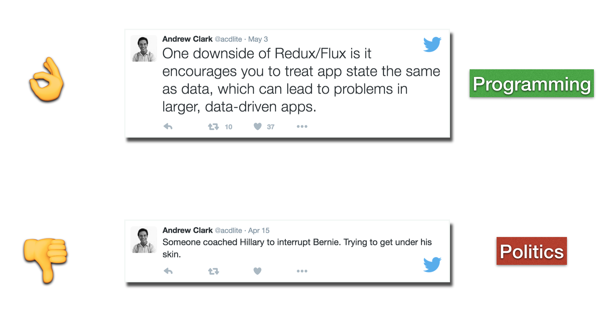
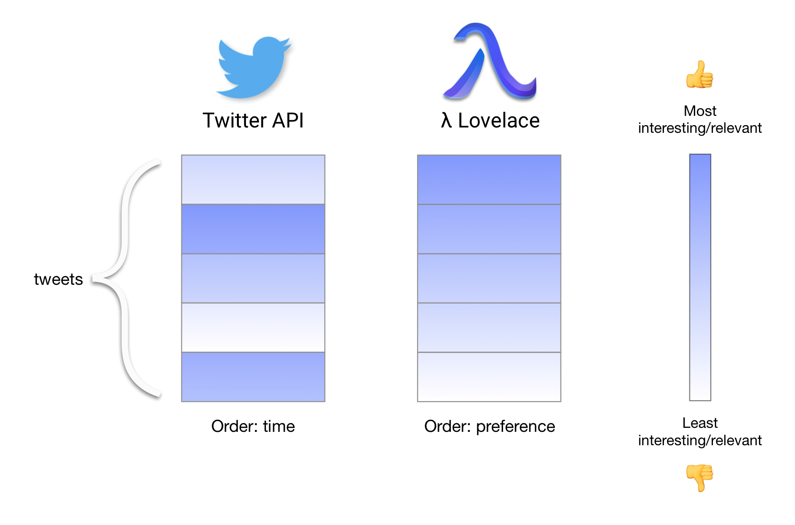
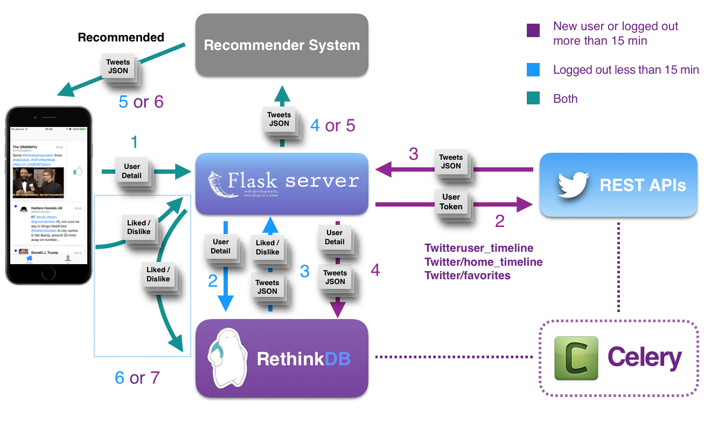
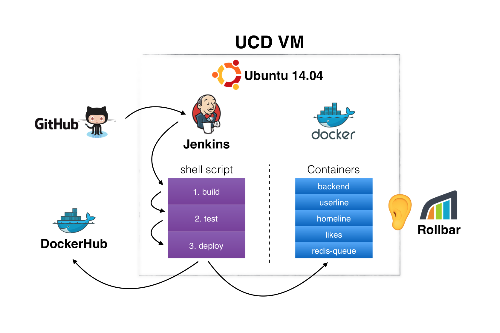
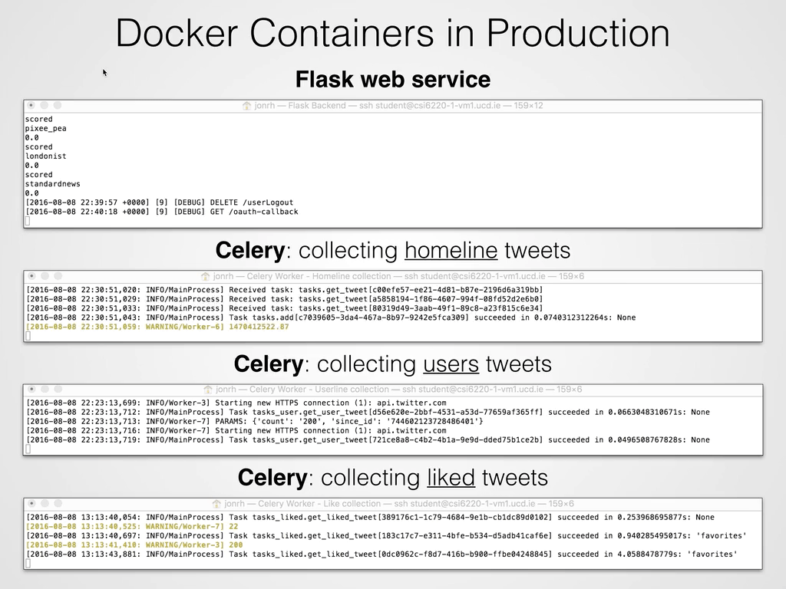
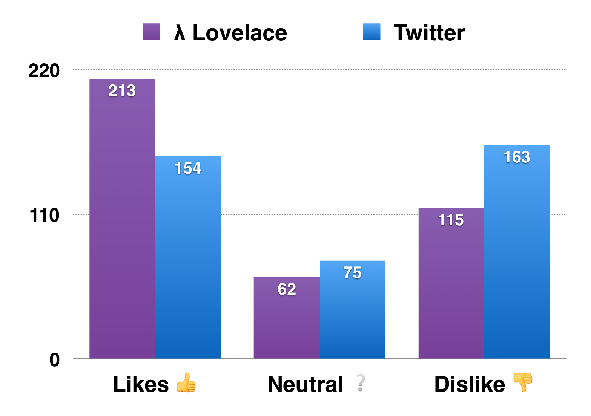

# λ Lovelace
This is a repository for a final project in the 30 ECTS credit module COMP47250 Team Software Project 2016. Submitted to the School of Computer Science \& Informatics in partial fulfilment of the requirements for the degree of Masters of Science in Computer Science (Negotiated Learning) at [University College Dublin](http://www.ucd.ie/). Summer 2016.

<table align="center">
  <tr>
  	<th>Links:</th>
  	<th>Team members:</th>
  </tr>
  
  <tr>
    <td>		
		<ul align="left">
			<li><a href="./documentation/final_report/Lambda-Lovelace_Final-Report-UCD-2016.pdf">Final report</a></li>
			<li><a href="./documentation/final_presentation/lambda-lovelace_final-presintation.pdf">Presentation slides</a></li>
			<li><a href="http://jonrh.github.io/lambda-lovelace/">Project blog diary</a></li>
		<ul>
    </td>
    
    <td>
    	<ul align="left">
			<li>Jón Rúnar Helgason, <a href="https://github.com/jonrh">jonrh</a></li>
			<li>Xinqi Li, <a href="https://github.com/XinqiLi1992">XinqiLi1992</a></li>
			<li>Marc Laffan, <a href="https://github.com/Marc5690">Marc5690</a></li>
			<li>Junyang Ma, <a href="https://github.com/specter4mjy">specter4mjy</a></li>
			<li>Eazhilarasi Manivannan, <a href="https://github.com/Eazhilarasi">Eazhilarasi</a></li>
		<ul>
    </td>
  </tr>
</table>


## Introduction
Lambda Lovelace is a content based recommender system for [tweets](https://twitter.com). The main goal of the λ Lovelace system is to personalise the user’s feed based on their interests to combat noise and information overload inherent in traditional chronologically ordered Twitter feeds. Subject preference is sourced from the user’s personal tweets, retweets, and likes. Additional feedback such as more/less from author or subject was collected from our own prototype iOS Twitter client. 

Tweets were sourced from the Twitter REST API but were subject to hefty rate limits. To work around rate limits, Celery workers were constructed to collect and persist tweets slowly over time to a RethinkDB database. A Python Flask webservice backend serves the iOS app recommended tweets and collects the additional user feedback. The recommender system employs a two tier term frequency document approach. First a narrow net is cast to catch the highest quality tweets, then a wider more general net is cast on the remaining tweets to obtain a preference order on as many tweets as possible. 

We constructed a separate iOS app to perform A/B tests on Twitter power users. Evaluation experiments showed promising results for users with narrow subject interests but unfortunately evaluators were too few to draw firm conclusions.








## Project
**Summary**: A recommender system for tweets; a more personalised tweet stream.

The theme of 2016 for the group project module is *Future Of News*. The premise for our project is the assumption (or observation) that people are experiencing an information overload. Years or decades ago news or content creators were few (print, television, radio) compared to today. Now everyone with a computer or a smartphone can be a content creator. We believe that the future of news is going to be filtering and delivering personalised news to people. We see our project to be a stepping stone in that direction, starting with Twitter.

### Retrospective note
Today Twitter already employs their own recommender system for tweets so why did we attempt to do the same? In essence it came down to *unlucky* timing and search for the incorrect words in the project proposal phase. The final project took place during the summer of 2016 but teams started formulating project ideas in the spring semester. We conceived our idea in the beginning of March 2016. Unknown to us, Twitter had announced in a [blog post](https://goo.gl/UqTIRz) on the 10th of February that tweet recommendations were available as an opt-in feature in the official Twitter mobile app. On the 17th of March, Twitter started to silently roll out tweet recommendations as an opt-out feature. None of the team members noticed the change. It was not until week two of our project (23rd of May) when we started to dig deeper into the literature review that we learned that Twitter had in fact already implemented much of what we intended to build.

This experience set a bittersweet tone for the remainder of the project. On one hand we regretted not having done a more thorough research in the early project proposal stage yet on the other hand we felt exhilarated knowing we had the right kind of ideas since Twitter was already recommending tweets. They just beat us to it by a few weeks.

### Scope
On a very high level there are two main components to the project:

* **Front-end**: iOS Twitter mobile app
* **Back-end**: Collaborative recommender system

A Twitter user uses our iOS mobile client and grants us API access. Uninteresting tweets are filtered out (or deferred to later) while interesting tweets are prioritised in the timeline. Tweets from non-followers may be suggested as well. Essentially we hoped to create a better, more personalised timeline of tweets than what chronologically ordered feed provides. Our iOS app will make observations of the users engagements (opening, liking, time in focus, etc) and sends the information to the recommender back-end for further recommendations.

The mobile app is required in order to collect additional user preference information to refine the recommendations. For example, if a user clicks a link in a tweet, likes a tweet, retweets, or engages in conversations. Another potential passive observation mechanism would be to have the client measure the amount of time a tweet is visible. Thinking being if a tweet is in focus for longer it might be of more interest than a tweet that is scrolled past quickly.

Our contributions or novelty if you will are as follows:

1. Filter out uninteresting tweets (or defer to later)
2. Collect additional user preferences in a mobile app
3. Show interesting tweets from non-followers

These are ordered by priority, that is we will first strive to implement tweet filtering, then data collection in the mobile app and if things go well we will try to introduce outsider tweets that might be of interest to the user.

In the beginning our project scope was to create a general recommendation system for all sorts of media: news, tweets, blogs, videos, etc. However given professor's feedback we decided to focus the idea on Twitter. We believe that doing so will allow us to deliver a more refined and complete solution. In retrospect this turned out to be a very good suggestion.


## Technical Decisions
Here below are some of the technical decisions we made:

- **Mobile**: iOS 9 + Swift 2.2
- **Recommender System**: Python 2.7, 
- **Back-end web service**: Python 2.7 and [Flask](http://flask.pocoo.org/) 
- **Database**: RethinkDB


## Project Management

For project management we keept it loose & lean. We used [ZenHub](https://www.zenhub.io/) to augment GitHub so we got a Kanban style board for issues and burndown charts to track milestone progresses. To use it we installed a [Chrome extension](https://chrome.google.com/webstore/detail/zenhub-for-github/ogcgkffhplmphkaahpmffcafajaocjbd). After the extension was installed we simply went to the GitHub [repository](https://github.com/jonrh/lambda-lovelace) and the extra features were there on the page. It should be noted that this functionality has since been added natively in a limited capacity with GitHub Projects.

### Roles
* **Backend**: Xinxqi & Marc Laffan
* **Frontend**: Junyang Ma, Eazhilarasi, Xinxqi
* **Evaluation**: Junyang Ma
* **User Experience**: Eazhilarasi
* **Project Management & Communications**: Jón Rúnar


### Schedule & Deliverables
~~2016-05-17		Lecture 1 (10:00 - 16:00)~~  
~~2016-05-24		Lecture 2 (13:00 - 16:00)~~  
~~2016-05-31		Week 3 Lab (13:00 - 16:00)~~  
~~**2016-06-10		Week 4: Project Plan** (17:00)~~  
~~2016-06-14		Week 5 Lab (13:00 - 16:00)~~  
~~**2016-06-21		Mid-term presentations** (10:00 - 17:00)~~  
~~**2016-06-24		Mid-term report**~~  
~~2016-07-05		Week 8 Lab (13:00 - 16:00)~~  
~~**2016-07-15		User evaluation report**~~  
~~2016-07-19		Week 10 Lab (13:00 - 16:00)~~  
~~2016-08-02		Week 12 Lab (13:00 - 16:00)~~  
~~**2016-08-09		Final presentations** (10:00 - 17:00)~~  
~~**2016-08-19		Final Report & Code**~~  


### Week Calendar
|             |    M    |    T    |    W    |    T    |    F    |    S    |    S    | Month     |
|------------:|:-------:|:-------:|:-------:|:-------:|:-------:|:-------:|:-------:|:----------|
| **Week 1**  | 16      | 17      | 18      | 19      | 20      | 21      | 22      | May       |
| **Week 2**  | 23      | 24      | 25      | 26      | 27      | 28      | 29      | May       |
| **Week 3**  | 30      | *31*    | 1       | 2       | 3       | 4       | 5       | May/June  |
| **Week 4**  | 6       | 7       | 8       | 9       | **10**  | 11      | 12      | June      |
| **Week 5**  | 13      | *14*    | 15      | 16      | 17      | 18      | 19      | June      |
| **Week 6**  | 20      | **21**  | 22      | 23      | **24**  | 25      | 26      | June      |
| **Week 7**  | 27      | 28      | 29      | 30      | 1       | 2       | 3       | June/July |
| **Week 8**  | 4       | *5*     | 6       | 7       | 8       | 9       | 10      | July      |
| **Week 9**  | 11      | 12      | 13      | 14      | **15**  | 16      | 17      | July      |
| **Week 10** | 18      | *19*    | 20      | 21      | 22      | 23      | 24      | July      |
| **Week 11** | 25      | 26      | 27      | 28      | 29      | 30      | 31      | July      |
| **Week 12** | 1       | *2*     | 3       | 4       | 5       | 6       | 7       | August    |
| **Week 13** | 8       | **9**   | 10      | 11      | 12      | 13      | 14      | August    |
| **Week 14** | 15      | 16      | 17      | 18      | **19**  | 20      | 21      | August    |

**Bold**: Deliverable or presentation  
*Italic*: Show & Tell


### Blog and Show'n'tell
Moodle Deadlines:

* **Blog post**: 17:00 on the Monday before
* **Show & Tell slides**: 12:00 on Tuesday

|             |     Blog    |    Show & Tell    |
|------------:|:------------|:------------------|
| **Week 3**  | Jón Rúnar   | Jón Rúnar         |
| **Week 4**  | Xinqi       |                   |
| **Week 5**  | Marc        | Marc              |
| **Week 6**  |             |                   |
| **Week 7**  |             |                   |
| **Week 8**  | Eazhilarasi | Eazhilarasi       |
| **Week 9**  | Jón Rúnar   |                   |
| **Week 10** | Junyang     | Junyang           |
| **Week 11** | Marc        |                   |
| **Week 12** | Xinqi       | Xinqi             |


## Getting Started
Here are the instructions we used when developing for the project.

**Quick Start**:

1. Install the [ZenHub Chrome extension](https://chrome.google.com/webstore/detail/zenhub-for-github/ogcgkffhplmphkaahpmffcafajaocjbd). See [Project Managment](#project-managmnent) for more details.
2. Clone `master` and `gh-pages` brances into seperate local repositories (folders)

There are two main branches: `master` (code & docs) and `gh-pages` (blog). It's best to clone both branches in a seperate folder because they do not share any common code.

```
// Go to the folder you want to keep the GitHubCode/ folder

mkdir GitHubCode
cd GitHubCode/

// Clone the master branch into the folder lambda-lovelace/
git clone https://github.com/jonrh/lambda-lovelace.git

// If you're not going to be working with the blow the blow can be skipped
// Clone the gh-pages branch into the folder ll-blog/
git clone https://github.com/jonrh/lambda-lovelace.git ll-blog/
cd ll-blog
git checkout -b gh-pages origin/gh-pages
```

**Note**: All usernames, passwords, server URLs, tokens and secrets have been revoked/changed. The repository contains these items in clear text in the code. Hardly an ideal production practice but an acceptable compromise we made given the short amount of time we had for the project. We could have replaced these strings but we wanted to maintain an untouched Git history. That way issues that link to specific commits will remain in tact.